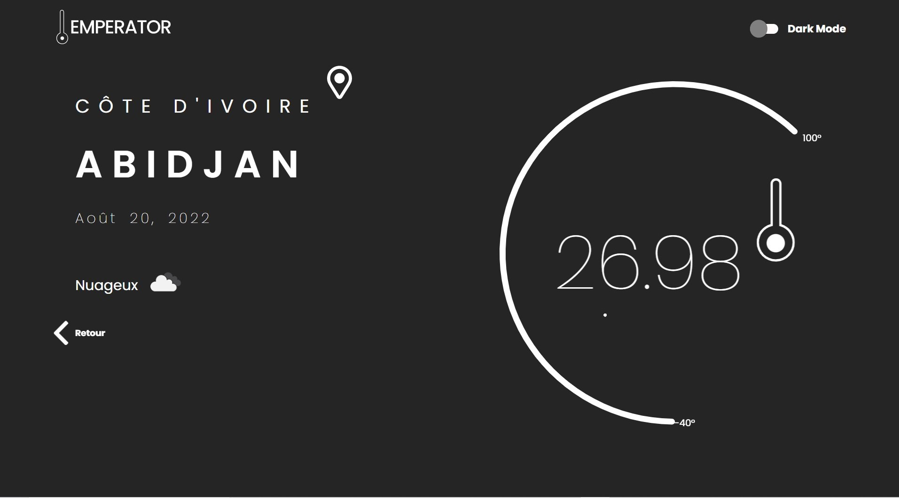

# Weather-FastAPI-App

## Description

This is a weather app that uses the OpenWeatherMap API.
I conbined the weather app with the FastAPI framework to create a fast and lightweight weather app.

### Presentation


This is the home screen of the app .This page contains a drop-down menu of cities in my country.


Always on the home screen you select a city to display the temperature of it.



This is the temperature view of the app. Click on toggle button to see the ligth mode and the dark mode.


## Installation

Install FastAPI and OpenWeatherMap API
- install python and pip

```bash
sudo apt-get update
sudo apt-get install python3.8 python3-pip
```	
- clone repository

```bash
git clone https://github.com/rezar12/Weather-FastAPI-App.git
```	
- install dependencies

```bash
pip install -r requirements.txt
```
- run the app

```bash
uvicorn main:app --reload
```

